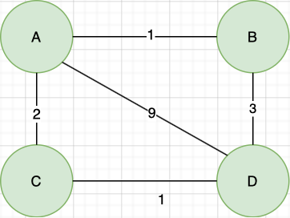
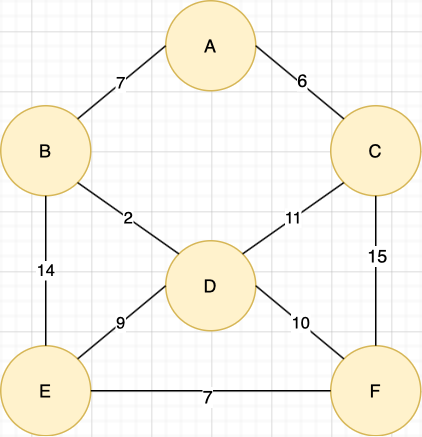
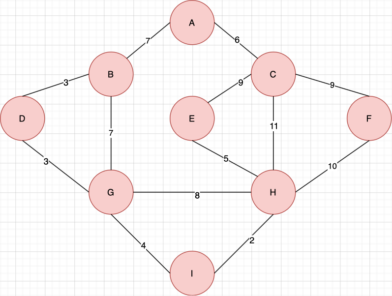

# Dijkstra's Algorithm

<p align="center">
  
</p>


## Background Information

In 1959 Edsger W. Dijkstra published a paper with an algorithm to solve the travelling salesman problem [[1]](#1). Given two nodes within an undirected graph (with non-negative weights) find the shortest distance between them.

This repository contains an implementation of the algorithm written in Java runs in O(|N|^2) time and uses space O(|N| +2|E|).

## Usage

* To compile the code in this repository use the following commands:

```
$ cd ./src
$ javac ./Main.java ./GraphPack/*.java
```

* To run the code in this repository use the following command:

```
$ java Main
```

* The code contains 3 Example graphs to use, to select a graph use the -g option followed by the example number of the graph you would like to use. Example 1: a simpleGraph is chosen by default.

* To use Example 2 use the following command:

```
$ java Main -g 2
```
## Examples

### Example 1: simpleGraph

<p align="left">
  
</p>

### Example 2: mediumGraph 

<p align="left">
  
</p>

### Example 3: hardGraph

<p align="left">
  
</p>


## References

<a id="1">[1] Dijkstra, Edsger W. 
“A note on two problems in connection with graphs” 
Numerische Mathematik 1
1959
pp. 83–89.</a> 

