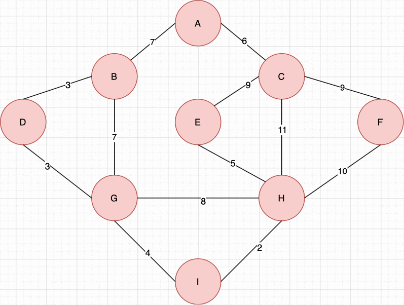

# Dijkstra's Algorithm

  

## Background

In 1959 Edsger W. Dijkstra published a paper with an algorithm to solve the travelling salesman problem [[1]](#1). Given two nodes within an undirected graph (with non-negative weights) find the shortest distance between them.

This repository contains an implementation of the algorithm written in Java runs in O(|N|^2) time and uses space O(|N| +2|E|).

## References

<a id="1">[1] Dijkstra, Edsger W. 
“A note on two problems in connection with graphs” 
Numerische Mathematik 1
1959
pp. 83–89.</a> 

